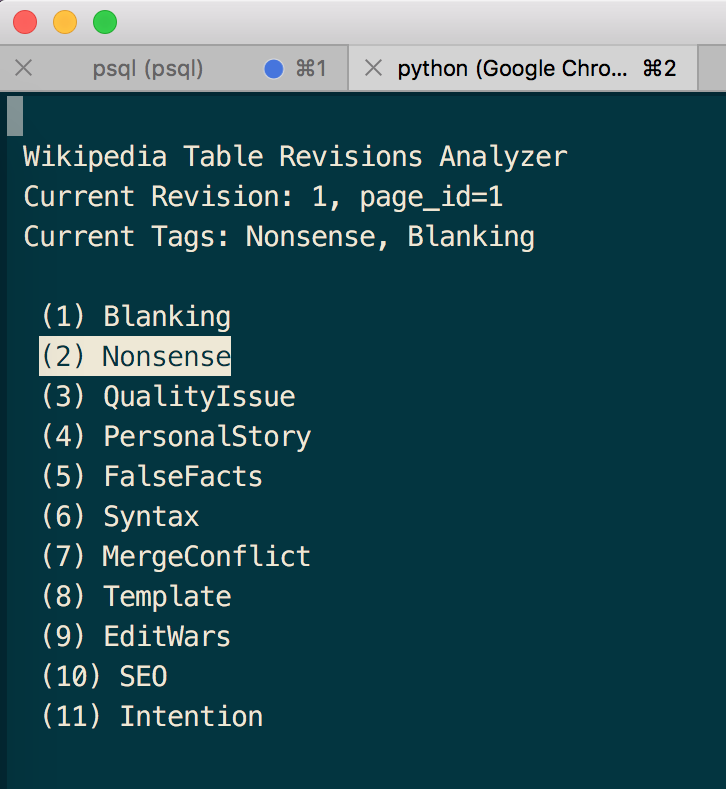

# WP Corpus Tagging Utility

## What is it?

This utility is a command line script that reads revisions from a revision database and allows the user to view the 
revision content and tag it accordingly.

## Setup

Below instructions are tested for OS X and the Homebrew package manager.

```
$ brew install pipenv
$ brew cask install chromedriver  # Selenium only
$ pipenv sync
$ pipenv shell
```

Selenium has the capability to reuse the same tab when opening the revision.
In case you are experiencing issues while installing Selenium or the driver component, you may disable Selenium (see below) and use the fallback implementation which may open a new tab for each revision you are tagging.

## Running

    python -m tagger -h 			# Show help
    python -m tagger  				# Run
    python -m tagger --no-selenium	# Run without Selenium

## Keyboard Shortcuts

<pre>
<kbd>0</kbd>-<kbd>9</kbd>	  Add tag at position X to selection
<kbd>↑</kbd>		Select above tag from list
<kbd>↓</kbd>		Select below tag from list
<kbd>⏎</kbd>		Add current tag to selection
<kbd>w</kbd>		Remove current tag from selection
<kbd>j</kbd>		Add selected tags to revision and go to next
<kbd>q</kbd>		Quit
</pre>

## Screens




